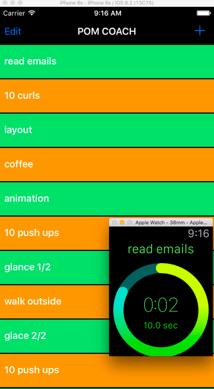

PomCoach
========
PomCoach is a demo app to build an Watch app step by steps. You can find the tutorials on my blog post(coming soon).

## What is the app doing?
Have you ever wonder how to get more things done during the day, how to stay focus on your tasks? 
You might already have heard of the [Pomodoro technique](https://en.wikipedia.org/wiki/Pomodoro_Technique): based on some Agile iterative concepts, you break your day in small tasks interlaced with small breaks. 

## Pre-requisites
* iOS9.2
* watchOS2
* iPhone/Watch (some stuff not working so well on simulator)

## Build it
```
open Pom.xcodeproj
```
## Run it
Et voila!


